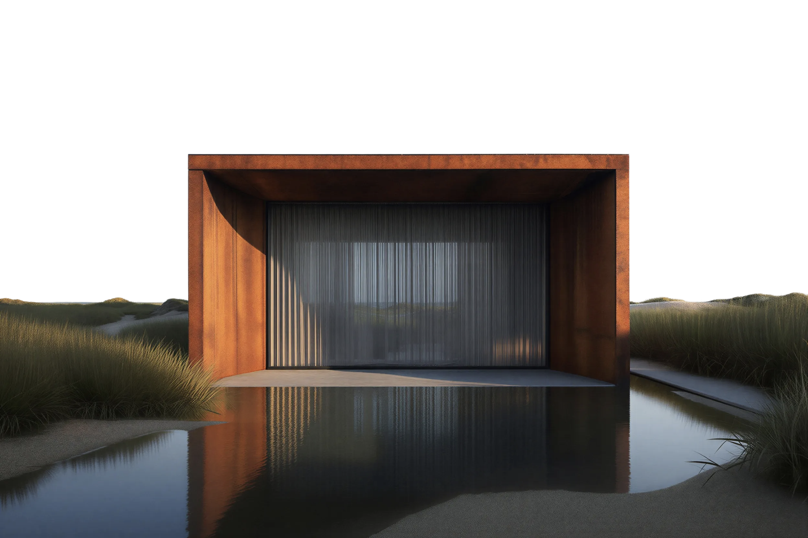

# Modern Architecture Landing Page

A stunning architecture firm landing page built with Next.js, React, and Tailwind CSS. Features a premium dark aesthetic with elegant UI components, smooth animations, and professional imagery.



## Tech Stack

- **Framework**: Next.js 16
- **UI Library**: React 19
- **Styling**: Tailwind CSS 4
- **Components**: Radix UI + shadcn/ui
- **Animations**: Framer Motion, Embla Carousel
- **Charts**: Recharts
- **Forms**: React Hook Form + Zod
- **Icons**: Lucide React

## Features

- Responsive design with mobile-first approach
- Dark theme with elegant typography
- Smooth animations and transitions
- Interactive testimonials carousel
- Featured products showcase
- Technology section
- Philosophy & editorial sections
- Image gallery with fade effects
- Toast notifications
- Theme provider with system preference detection

## Project Structure

```
.
├── app/                    # Next.js app directory
│   ├── layout.tsx         # Root layout
│   ├── page.tsx           # Home page
│   └── globals.css         # Global styles
├── components/            # React components
│   ├── sections/         # Page sections
│   ├── ui/              # shadcn/ui components
│   ├── header.tsx       # Header component
│   ├── fade-image.tsx    # Fade image component
│   └── theme-provider.tsx # Theme provider
├── hooks/                # Custom React hooks
│   ├── use-mobile.ts    # Mobile detection
│   └── use-toast.ts    # Toast hook
├── lib/                  # Utilities
│   └── utils.ts         # Helper functions
├── public/              # Static assets
│   └── images/          # Image assets
├── styles/              # Additional styles
│   └── globals.css      # Global CSS
└── .gitignore          # Git ignore
```

## Getting Started

### Prerequisites

- Node.js 18+
- pnpm (recommended) or npm

### Installation

```bash
# Install dependencies
pnpm install

# Run development server
pnpm dev

# Build for production
pnpm build

# Start production server
pnpm start
```

## Image Assets

The project includes high-quality architecture and interior images:

| Image | Description |
|-------|-------------|
| `hero-mono.png` | Hero section main image |
| `mono-1.png` - `mono-4.png` | Featured property images |
| `hero-side-1.png` - `hero-side-4.png` | Hero side images |
| `architecture-sketch-*.png` | Architecture sketches |
| `interior-view.png` | Interior view |
| `rusted-metal.png` | Material showcase |

## Available Scripts

- `pnpm dev` - Start development server
- `pnpm build` - Build for production
- `pnpm start` - Start production server
- `pnpm lint` - Run ESLint

## License

MIT License - Feel free to use this project for your own portfolio or commercial projects.

## Credits

Built with modern web technologies and inspired by premium architecture firm websites.

---

<p align="center">Crafted with attention to detail ✨</p>